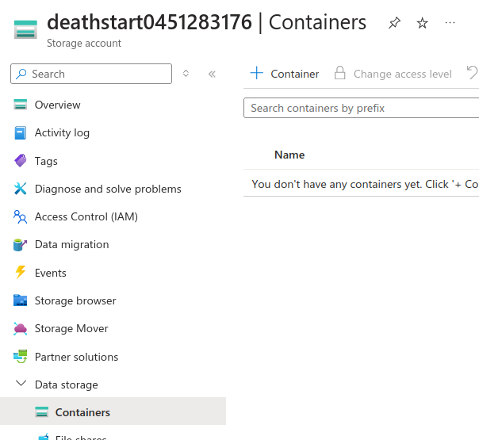

# Creating a data lake

Azure:

- Go to services > storage accounts.
- Create a storage account.
- In the storage account, find "Data storage" > "Containers".
- Create a container, by clicking on the "+" button:

From a VM, to list the containers on a particular storage account, type:

`az storage container list --account-name=<account_name>`

To check if a container exists:

`az storage container exists --account-name=<account_name> -n <container-name>`

To upload a file to the storage container via a VM:
`az storage blob upload --account-name <account_name> --container-name big-store --name test-2.txt --file test.txt`
    - This command checks for a local file "test.txt" and uploads it to the blob with the name "test-2.txt".

To list the blobs on a storage container:
`az storage blob list --account-name <account_name> --container-name <container_name>`

To download a blob from a storage container:
`az storage blob download --account-name <account_name> --container-name <container_name>`

To delete a blob from a storage container:
`az storage blob list --account-name deathstart0451283176 --container-name big-store`

From what I understand, azure container storage sizes are flexible. I.e. if you upload to a container, chances are that it would get uploaded without issues, and azure would create necessary disk space to accomodate it.
